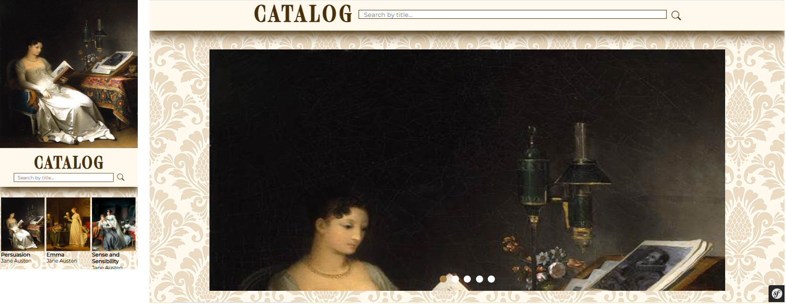
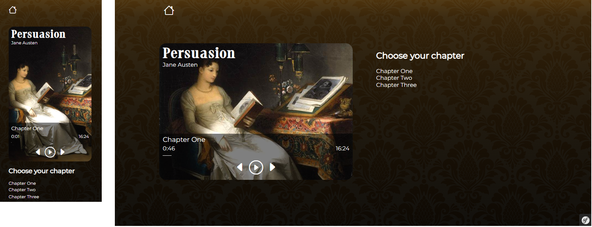

# Public Voices

A web application made with Symfony, that provides access to audiobooks from the public domain.


## Core Features

- Catalog Display
- Audiobook Player
- User Account
- Admin Dashboard


## 🧰 Tool Box for this project


## 📷 Screenshots

Admin Dashboard


Catalog Page


Audiobook Player Page



## Tips

If you import my sql file 'audiobook_player' located in the 00_readme folder

- You can go to yourlocalhost/login
- And use the account admin@admin.com / adminadmin
- Create audiobook informations in this order : author, genre, audiobook, chapter


Otherwise :
- Create your own account at : yourlocalhost/register
- Create audiobook informations in this order : author, genre, audiobook, chapter


If you upload your own audio files, remember to check your php.ini to change the size limit if necessary.


## Code Tricks

As a collection, chapters datas needed to be formatted on the back end side, in order to pass them on the front side  for Javascript and the audiobook player. Here is one way to do it. 


In the audiobook player controller, inside the index function :

```php
        $chaptersData = [];
        foreach ($chapters as $chapter) {
            $chaptersData[] = [
                'id' => $chapter->getId(),
                'title' => $chapter->getTitle(),
                'audioUrl' => '/upload/chapters_audios/' . $chapter->getAudioFilename(), // Adjust based on your entity
                'duration' => $chapter->getDuration(), // Add the duration
            ];
        }


    
        return $this->render('playback/index.html.twig', [
            'audiobook' => $audiobook,
            'chapters' => $chaptersData,
            'selectedChapter' => $selectedChapter,
        ]);
```


In the audiobook player template

```html

  

  <script id="chapters-data" type="application/json">
        {{ chapters|json_encode()|raw }}
      </script>

  
```


## Future Improvements

- Catalog Filters
- Advanced Search
- User Account


## 🍞 About Me
Hi everyone, I'm Madame R. a Web Developer from France. 
Currently in training, I'm a database enthusiast.
Enjoy your stay, have a look at my other repositories and let's get in touch if you wish to work with me.


## 🛠️ Tech Stack

**Database:** MySQL , Doctrine

**Back End:** PHP, Symfony

**Front End:** HTML, CSS, Javascript

**IDE:** Visual Studio Code


## ❤️ Acknowledgements


API

 - [Librivox and their volunteers for their amazing work ](https://librivox.org/)

Front End

 - [Public Domain Review for their inspiring work ](https://publicdomainreview.org/)

 - [Marguerite Gérard ](https://en.wikipedia.org/wiki/Marguerite_G%C3%A9rard)
 - [Kawanabe Kyōsai](https://en.wikipedia.org/wiki/Kawanabe_Ky%C5%8Dsai)
 - [Franck Rinehart](https://en.wikipedia.org/wiki/Frank_Rinehart)


## 📜 License


