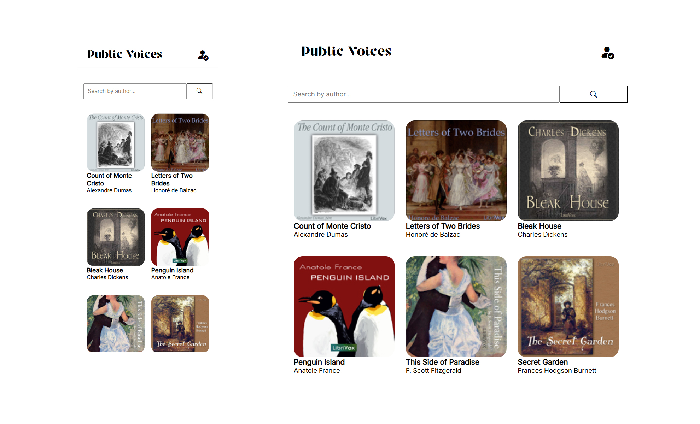
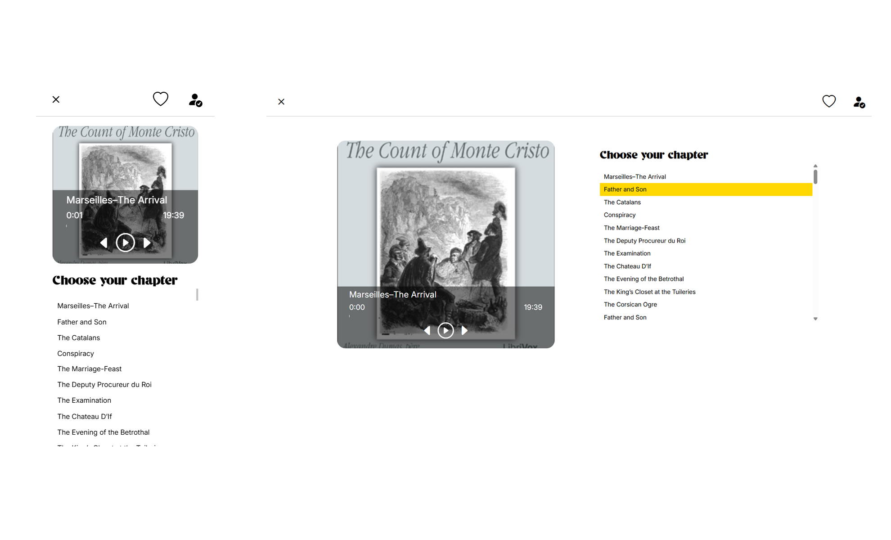
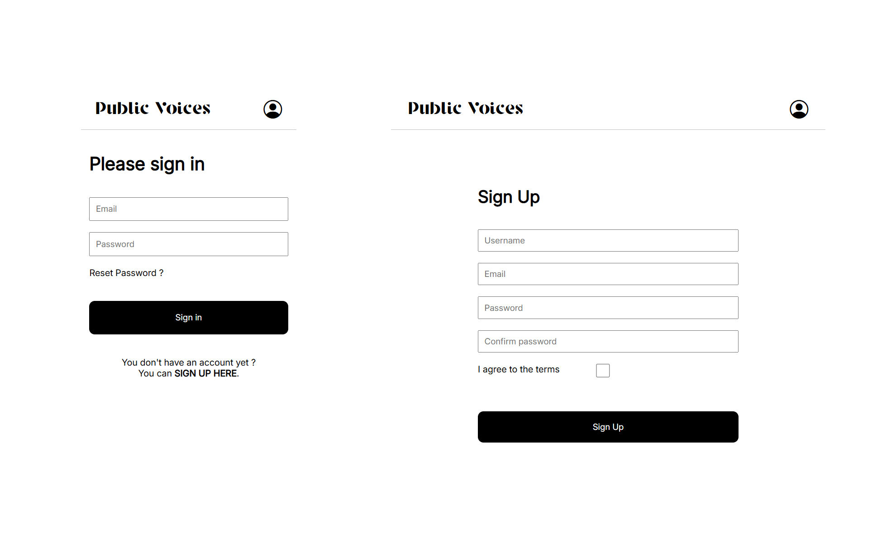
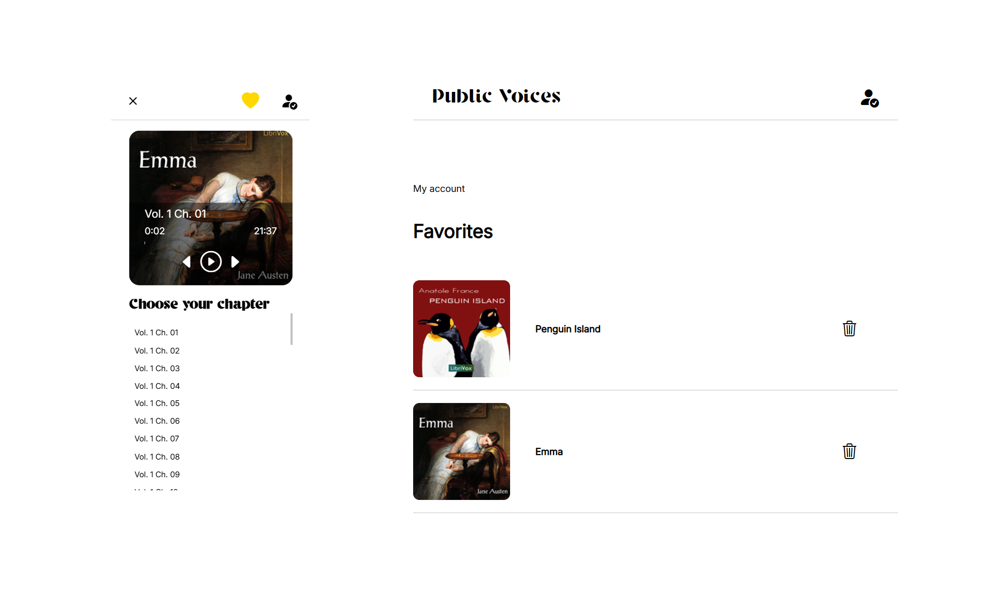

# Public Voices

Millions of public domain audiobooks are available online, but accessing them through a user-friendly and personalized interface is often difficult. Public Voices solves this by integrating with the LibriVox API to deliver a clean, responsive web application where users can search, stream, and save their favorite audiobooks. The result is a seamless listening experience with personalized features, all built on modern, open technologies.

## 🧰 Tool Box


## 🎯 Core Features


### 👤 User Accounts
- Secure user registration and login
- Email confirmation with redirect to login page
- Password reset with email link
- Personal dashboard with favorite audiobooks

### 🔐 Security
- Role-based route protection (`ROLE_USER`)
- CSRF protection and input validation
- Authentication handled by Symfony’s security component

### 🔗 APIs
  - Public: LibriVox API (audiobook data)
  - Private: Internal REST API (user accounts)


### 📚 Audiobook Catalog
- Lazy-loading
- Search by author 
- Live data fetched from the LibriVox API

### ▶️ Audiobook Player
- Built-in player for streaming audiobooks
- Option to add/remove books from favorites


### 📱 Responsive UI
- Clean and mobile-friendly design
- Compatible across modern browsers


## 📷 Screenshots

**Catalog**


**Player**


**Authentication**


**Favorites**



## 🚀 Getting Started (Local Development)

### Prerequisites

- Git
- Docker & Docker Compose
- Symfony

---

### 🔧 Installation 

1. **Clone the repository**

```bash
git clone https://github.com/madame-r/symfony_public_voices.git
cd symfony_public_voices
```

2. **Update the .env file**

Use your database credentials and Mailer DSN if needed.


3. **Start Docker containers**

```bash
docker-compose up --build -d
```

4. **Install PHP dependencies**

```bash
docker exec php composer install

```

5. **Create the database**

```bash
docker exec php bin/console doctrine:database:create

```

6. **Run migrations**

```bash
docker exec php bin/console doctrine:migrations:migrate

```


## 📌 Roadmap

 - Admin panel (ROLE_ADMIN)

 - Bookmarks & resume playback

 - Offline listening (PWA support)

 - UI/UX enhancements


## ❤️ Acknowledgements

 - [Librivox and their volunteers for their amazing work ](https://librivox.org/)

 - [Public Domain Review for their inspiring work ](https://publicdomainreview.org/)


## 📜 License


